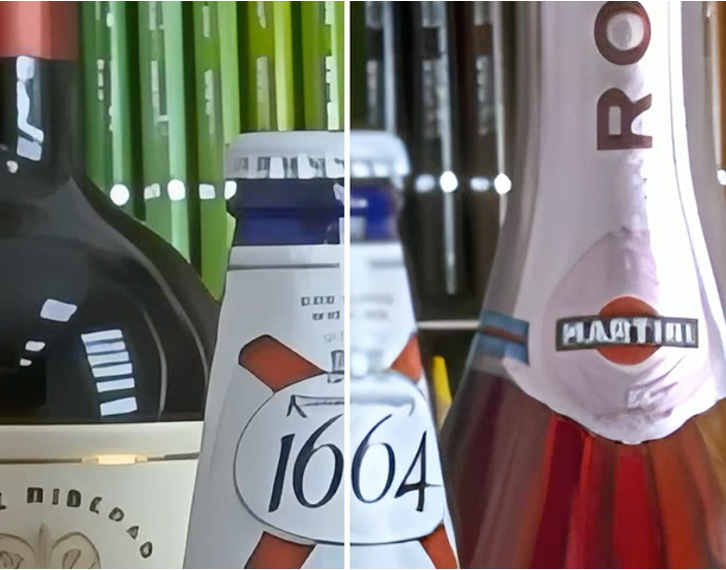

# [ECCV 2024] Pairwise Distance Distillation
### Pairwise Distance Distillation for Unsupervised Real-World Image Super-Resolution  
[](https://arxiv.org/abs/<INDEX>)   
Yuehan Zhang<sup>1</sup>, Seungjun Lee<sup>2</sup>, Angela Yao<sup>1</sup>  
National University of Singapore<sup>1</sup>, Korea University<sup>2</sup>  
<p align="center">

</p>
  
## 📝PDD
We address the **unsupervised RWSR** for a targeted real-world degradation. We study from a distillation perspective and introduce a novel Pairwise Distance Distillation framework.
Through our framework, a model specialized in synthetic degradation adapts to target real-world degradations by distilling intra- and inter-model distances across the specialized model and an auxiliary generalized model. 

Our method, as a learning framework, can be applied to off-the-shelf generalist models, e.g., RealESRGAN, and improve their performance in a real-world domain!

## 🎯 TODOS
* <del>Complete code; release installation and training instructions</del>
* <del>Public the repository</del>
* Debug environment settings
* Release model weights
* Update links to datasets
* Update visual results
## 🖼️ Visual Examples
RealESRGAN + PDD | RealESRAGN
<p align="center">
  
  
  
</p>

## 👓 Key Features
We tackle the unsupervised SR for a given real-world dataset through a distillation perspective: 
- we combine the knowledge from a Generalist (blind generalized model) and a Specialist (optimized for specific synthetic degradation);
- we perform the distillation for **distances** between features of predictions, rather than features themselves;
- only the Specialist is updated by gradients, and the full optimization consists of unsupervised distillation and supervised loss on synthetic data.

The distillation is based on the consistency of intra- and inter-model distances. We refer to the paper for explorations that establish these consistencies 😃.

We provide Static and EMA configurations for our method. The latter requires a single pretrained model and exhibits better performance.

## 🔨 Installation
#### Setup Environment  
Python >= 3.9  
PyTorch > 2.0  
[MMEngine](https://github.com/open-mmlab/mmengine)  
[mmcv](https://github.com/open-mmlab/mmcv) ( 2.0.0 <= mmcv < 2.2.0)  
[mmagic](https://github.com/open-mmlab/mmagic)
#### Install PDD
```sh
# Clone the repository
git clone https://github.com/Yuehan717/PDD.git

# Navigate into the repository
cd PDD

```
- If you only want to know the implementation, the main components of our method can be found in [srgan_ref_model.py](basicsr/models/srgan_ref_model.py) and [losses.py](basicsr/losses/losses.py) 😃.

## 👉 Datasets & Model Weights
#### Datasets
Our method requires two sets of data for training:
- Paired synthetic data: We use ground-truth images in DF2K and create LRs on the fly.
- LR real-world data: In the paper, we experiment with RealSR, DRealSR, and NTRIE20.

#### Model Weights
*Coming soon*
## 👉 Usage
```sh
# training instructions

### Please replace the path in .yml files with our own path.

## Distributed Training (recommend 2 gpus)
PYTHONPATH="./:${PYTHONPATH}" \
torchrun --nproc_per_node=[number_of_gpus] --master_port=[port] basicsr/train_mix.py \
-opt options/train/ESRGAN/[name_of_script].yml --launcher pytorch

## One-GPU Training
PYTHONPATH="./:${PYTHONPATH}" \
python basicsr/train_mix.py -opt options/train/ESRGAN/[name_of_script].yml

# Inference
python inference_SISR.py --input_path [path_to_input_folder] \
--save_path [path_to_result_folder] --model [esrgan/bsrgan] \
--model_path [path_to_model_weights] --color_corr
```
#### Some Tips
- For EMA configuration, the hyperparameter domain_opt_warmup_iters (in [name_of_script].yml) can not be zero. It is to escape from the zero-distance state.
- The color correction is implemented in reference script inference_SISR.py. The argument *--color_corr* calls this function.
- The ratio between weights of intra- and inter-model distillation terms, as discussed in the paper, will influence the outputs' bias of fidelity and perception scores. For different real-world data, this ratio may need rounds of tuning to achieve the best balance. 
- The evaluation in the paper is based on [IQA-PyTorch](https://github.com/chaofengc/IQA-PyTorch).

## 👏 Acknowledgement
The code is based on [BasicSR](https://github.com/XPixelGroup/BasicSR). Thanks to their great contribution to the area!
