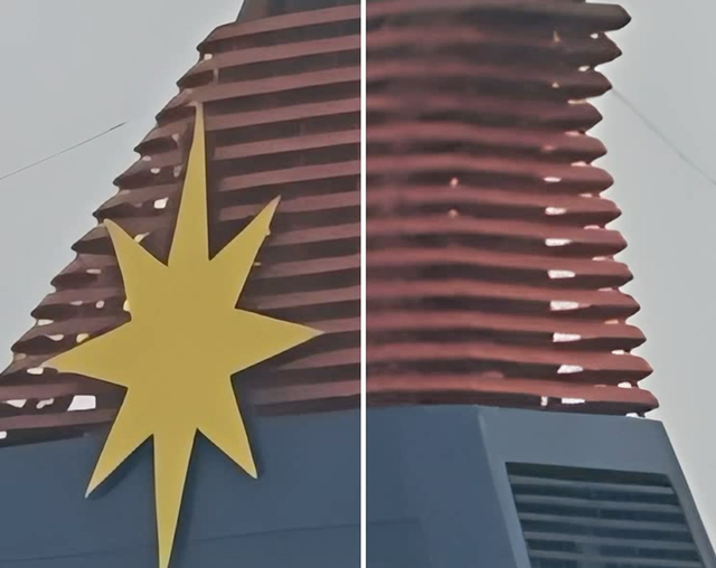

# [ECCV 2024] Pairwise Distance Distillation
### Pairwise Distance Distillation for Unsupervised Real-World Image Super-Resolution  
[](https://arxiv.org/abs/<INDEX>)   
Yuehan Zhang<sup>1</sup>, Seungjun Lee<sup>2</sup>, Angela Yao<sup>1</sup>  
National University of Singapore<sup>1</sup>, Korea University<sup>2</sup>  
<p align="center">

</p>
  
## 📝PDD
We address the **unsupervised RWSR** for a targeted real-world degradation. We study from a distillation perspective and introduce a novel Pairwise Distance Distillation framework.
Through our framework, a model specialized in synthetic degradation adapts to target real-world degradations by distilling intra- and inter-model distances across the specialized model and an auxiliary generalized model. 

Our method, as a learning framework, can be applied to off-the-shelf generalist models, e.g., RealESRGAN, and improve their performance in a real-world domain!

## 🎯 TODOS
* <del>Public the repository</del>
* Complete code; release installation and training instructions
* Release model weights
* Update links to datasets
* Update visual results
## 🖼️ Results
RealESRGAN + Our | RealESRAGN
<p align="center">
  
  
  
</p>

## 👓 Key Features
We tackle the unsupervised SR for a given real-world dataset through a distillation perspective: 
- we combine the knowledge from a Generalist (blind generalized model) and a Specialist (optimized for specific synthetic degradation);
- we perform the distillation for **distances** between features of predictions, rather than features themselves;
- only the Specialist is updated by gradients, and the full optimization consists of unsupervised distillation and supervised loss on synthetic data.

The distillation is based on the consistency of intra- and inter-model distances. We refer to the paper for explorations that establish these consistencies. 😃

We provide Static and EMA configurations for our method. The latter requires a single pretrained model and exhibits better performance.

## 🔨 Installation
Instructions on how to set up the environment and dependencies required to run the code. Provide step-by-step commands:
```sh
# Clone the repository
git clone https://github.com/Yuehan717/PDD.git

# Navigate into the repository
cd PDD

# Install dependencies
TBA
```
- The provided code demonstrates the current implementation of our method. You can find the main components in [srgan_ref_model.py](basicsr/models/srgan_ref_model.py) and [losses.py](basicsr/losses/losses.py).
- We are in the process of cleaning and debugging the code and its environment. A finalized version together with instructions will be released soon.

## 👉 Datasets & Model Weights
#### Datasets
Our method requires two sets of data for training:
- Paired synthetic data: We use ground-truth images in DF2K and create LRs on the fly.
- LR real-world data: In the paper, we experiment with RealSR, DRealSR, and NTRIE20.

#### Model Weights
*Coming soon*
## 👉 Usage
*Coming soon*

## 👏 Acknowledgement
The code is based on [BasicSR](https://github.com/XPixelGroup/BasicSR). Thanks to their great contribution to the area!
